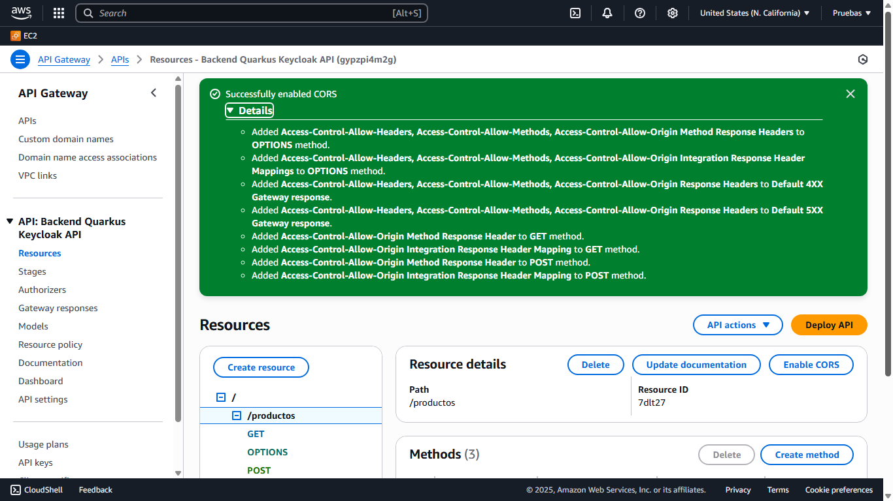
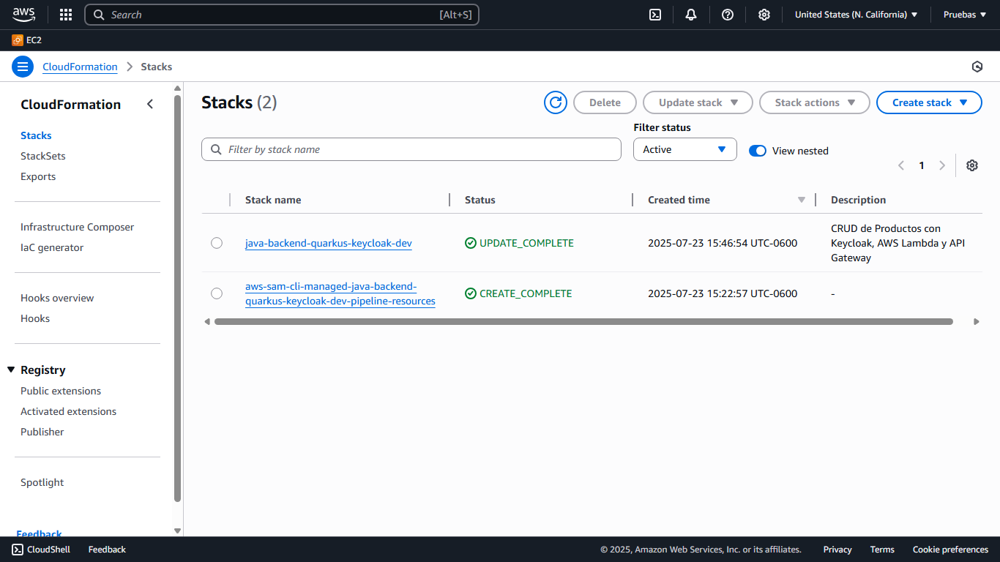
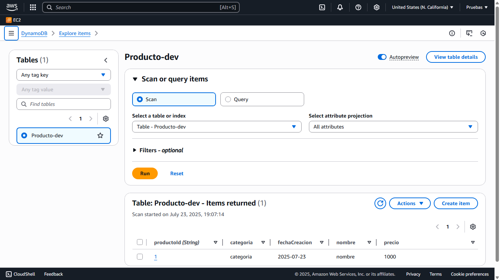
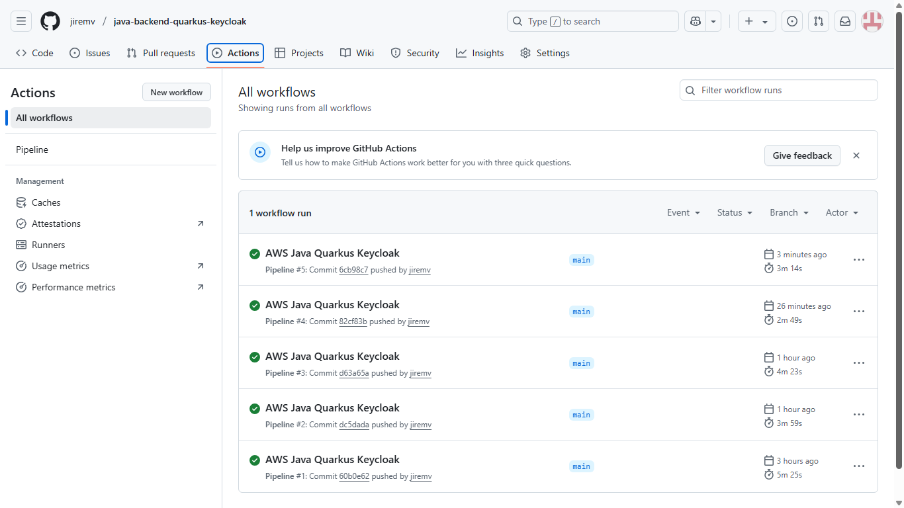
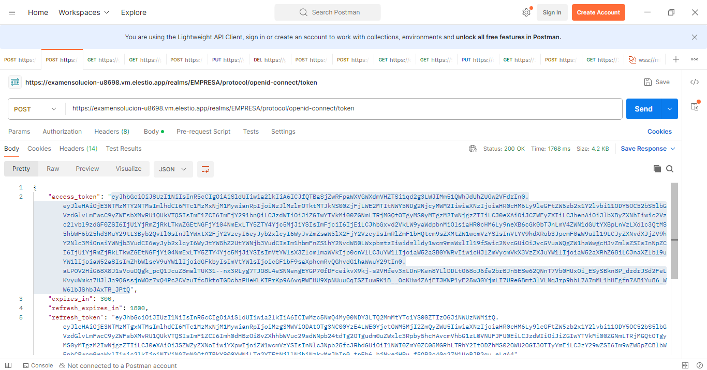
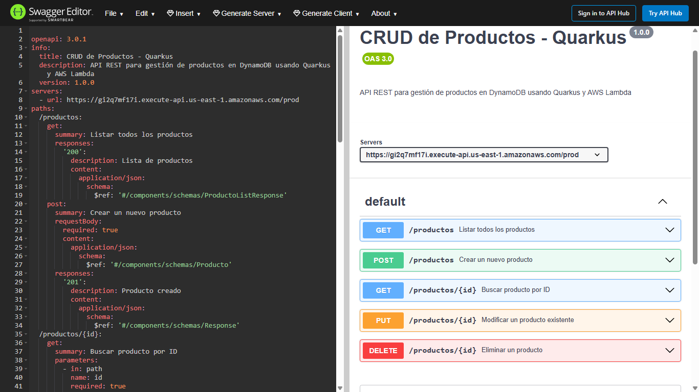

# 🔥  java-backend-quarkus

Application AWS Java with Quarkus and Keycloak Access Control 100% Serverless
https://gypzpi4m2g.execute-api.us-west-1.amazonaws.com/prod/productos

## 📄 Descripción

Este proyecto implementa una solución **serverless**. Esta solución no utiliza servidores EC2, tampoco contenedores Kuberrnetes. 
Es totalmente administrado por AWS el cual provee elasticidad, escalabilidad y alta disponibilidad.

Utilizamos **Amazon API Gateway** que se comunica muy bien con  **AWS CloudFormation**. 

También tenemos la base de datos 100% serverless **Amazon DynamoDB**. 
También se ha montado el Control de Acceso con Keycloak.
Keycloak nos proporciona el logueo, y la administración de roles de usuarios.
Para arquitecturas en AWS Lambda o contenedores, Quarkus Reactivo destaca por memoria, arranque y enfoque cloud-native.

---

## 🏗️ Arquitectura

```plaintext
 [Java (Quarkus)]
        │
        ▼
  Framework compatible con:
     - Programación Imperativa
     - Programación Reactiva (opcional: Mutiny, RESTEasy Reactive)
        │
        ▼
 Compilas el Backend como:
   Lambda Handler (RequestHandler)
        │
        ▼
 Lambda ejecuta el método handleRequest()
  (100% serverless, paga por ejecución)
        │
        ▼
 Se ejecutan los métodos de backend

```
| **Criterio**                 | **Quarkus Reactivo**                                                                              | **Spring WebFlux (Spring Reactivo)**                                        |
| ---------------------------- | ------------------------------------------------------------------------------------------------- | --------------------------------------------------------------------------- |
| **Consumo de memoria**       | 🔥 Muy bajo. Optimizado para contenedores y serverless. Reducción agresiva del footprint.         | ⚠️ Medio. Aunque optimizado, requiere más memoria por el contexto Spring.   |
| **Arranque (cold start)**    | ⚡ Muy rápido. Ideal para Lambda y entornos serverless donde el tiempo de arranque impacta costos. | 🕒 Más lento. El contexto de Spring Boot es más pesado en tiempo de inicio. |
| **Ecosistema en AWS Lambda** | ✅ Excelente. Soporte nativo. Imágenes optimizadas. Buen rendimiento serverless.                   | ⚠️ Bueno. Compatible, pero menos eficiente en Lambda (cold starts mayores). |
| **Orientación**              | 🎯 Microservicios ligeros, serverless, arquitecturas cloud-native.                                | 🎯 Microservicios clásicos. No orientado directamente a serverless.         |

## Keycloak
- Keycloak es una solución de código abierto para identidad y acceso (IAM) que proporciona autenticación, autorización, gestión de usuarios y federación de identidades lista para usar. Es ampliamente adoptado por su flexibilidad, seguridad y facilidad de integración con aplicaciones modernas.
- 
  🔐 SSO (Single Sign-On): Un solo inicio de sesión para múltiples apps.

👥 Gestión de usuarios y roles: Centralizada y fácil de administrar.

🛡️ Autenticación fuerte: Soporta MFA, OTP y autenticación social.

🌐 Estándares abiertos: Compatible con OAuth2, OIDC y SAML.

🔄 Federación de identidades: Integra LDAP, AD, Google, GitHub, etc.

🧩 Extensible: Personalizable con temas, flujos y autenticadores propios.

🚀 Escalable y productivo: Ideal para entornos cloud y microservicios.

📊 Eventos y auditoría: Registro detallado de acciones de seguridad.

🧪 API REST y UI admin: Administración automática y visual.

🆓 Código abierto: Sin costo de licencia, respaldado por Red Hat.

## Comparativa Serverless Java - AWS Lambda vs Azure Functions
Comparativa profesional del despliegue de funciones serverless escritas en **Java** en los entornos **AWS Lambda** y **Azure Functions**, destacando ventajas, limitaciones y costos asociados.


## Diagrama Comparativo

```plaintext
                SERVERLESS JAVA COMPARISON

                ┌──────────────────────────────────────────────────────┐
                │ AWS Lambda                 │
                └──────────────────────────────────────────────────────┘
                           │
           100% serverless (pago por uso)
                           │
      Cold start mitigable con SnapStart
                           │
       No necesitas instancias reservadas
                           │
           Costos variables (por ejecución)

                           ▼

                ✅ Optimizado para serverless


                ┌──────────────────────────────────────────────────────┐
                │ Azure Functions            │
                └──────────────────────────────────────────────────────┘
                           │
            Execution Plan (pago por uso)
                           │
      ⚠️ Cold starts graves con Java
                           │
      Premium Plan (instancias warm fijas)
                           │
      🔥 Costo fijo incluso sin tráfico
                           │
        No 100% serverless bajo Premium

                           ▼

               ⚠️ Penalización económica
            si deseas rendimiento constante
```


## Conclusión Profesional

- **AWS Lambda** permite una verdadera ejecución **serverless** optimizada para **Java**, gracias a SnapStart y frameworks ligeros como Quarkus o Micronaut.
- **Azure Functions**, aunque soporta Java, requiere activar el **Premium Plan** (costo fijo) para evitar los problemas de cold start.

---

> En proyectos serverless con Java donde la eficiencia y el costo variable son importantes, **AWS Lambda** es la opción recomendada.

---

## 🛠️ Servicios AWS utilizados

- **Amazon API Gateway**
  - Permite controlar CORS .
  - Permite HTTP RESTful.
  - Proporciona el API para cliente frontend.
    

- **AWS CloudFormation**
  - Proporciona IaC.
  - Crea el Stack en los ambientes Dev y Prod.
    

- **Amazon DynamoDB**
  - Base de Datos 100% serverless.
  - Es no relacional.
    

- **AWS SAM (Serverless Application Model)**
  - Despliegue de la infraestructura como código (`template.yaml`).

---

## 🚀 Despliegue del proyecto

### 1️⃣ GitHub Actions
- Diríjase al link Actions, allí podrá visualizar el despliegue DevOps.
  

### 2️⃣ Clona el repositorio y navega al proyecto:
```bash
git clone https://github.com/tu-usuario/java-backend-quarkus-keycloak.git
cd java-backend-quarkus-keycloak
```

### 3️⃣ Despliegue:
```bash
sam build
sam deploy --guided
```

Durante el despliegue:
- Proporciona el nombre del stack.
- Define la región AWS.
- Acepta permisos de tipo `CAPABILITY_IAM`.

---

## 📈 Beneficios del proyecto

- ✅ Completamente **serverless**.
- ✅ Alta disponibilidad, funciona 24x7x365 sin caídas.
- ✅ Totalmente elástica, si se conectan muchos usuarios, soporta la concurrencia sin límite.
- ✅ Arquitectura automatizada, simple y escalable. Para integrar más recursos y servicios.
- ✅ Costo controlado muy bajo 1$ al mes, sin servidores ni procesamiento batch complejo.

---

## 📘 Documentación de la API

Esta API RESTful está documentada con OpenAPI (Swagger).  
Puedes visualizarla usando herramientas como:
- [Swagger Editor](https://editor.swagger.io/)
- Swagger UI (local o en línea)
- Postman (importando el JSON/YAML)

---

## 📊 Colección para probar con Postman

La colección de pruebas crud es: Keycloak_Quarkus_crud.postman_collection.json



### Archivos incluidos
- `Keycloak_Quarkus_crud.postman_collection` – Colección de las pruebas con Postman
- `swagger-productos-con-token.json` – Formato OpenAPI 3.0
- `swagger-productos-con-token.yaml` – Alternativa legible en YAML

Estodo archivos se encuentran en la carpeta readme



---

## 📋 Consideraciones adicionales

- Este proyecto AWS puede ser montado para su empresa.
- El `template.yaml` crea automáticamente:
  - El cloudformation.
  - La base de datos.
  - El AWS api gateway.

- El proyecto es ideal para ahorrar costos y obtener alta rentabilidad.

---

## 📜 Licencia

Este proyecto es de código abierto. Puedes adaptarlo y reutilizarlo bajo los términos de tu organización.

---

## 🧑 Contacto

**Paul Rivera**
- AWS Certified Solutions Architect - Associate
- Oracle Java EE Master Developer

